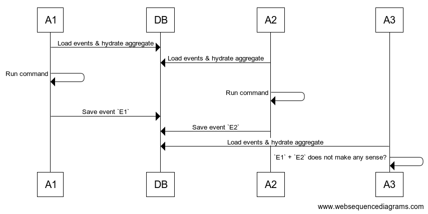

# ADR 008 - Use OCC to avoid race conditions

```
Author: @thomaseizinger
Date: 29/12/2021
Status: Active
```

## Summary

Use OCC (optimistic concurrency control) to avoid race conditions on concurrent command invocations.

## Context

[ADR 007](./007-event-sourcing-for-cfds.md) introduced event sourcing for CFDs.
Events are only produces by invoking _commands_ on an aggregate (the `Cfd` model).
Before a command can be invoked, all currently stored events for this CFD are loaded from the DB and the aggregate is hydrated from these events.
Once the command finishes, an event may be emitted which needs to be persisted to the DB.

If multiple actors hydrate the aggregate concurrently, this can lead to race conditions.
The problem is easily illustrated with the following diagram:



Here, the event produced by `A1` (`E1`) is saved first and `A2` should not save its event (`E2`) because the logic within the command handler did not take `E1` into account.
If we were to save the event regardless, we could end up in an inconsistent or unexpected state if a third actor comes around and now loads all events.

An elegant solution to this problem is to implement [optimistic concurrency control](https://en.wikipedia.org/wiki/Optimistic_concurrency_control).
What this means is that each event needs to carry its _expected_ version (which is simply aggregate version + 1).
Assuming we have 10 events in our database, then both `E1` and `E2` will have an expected version of 11.
`E1` will save just fine to the database but `E2` will fail because version 11 already exists.
